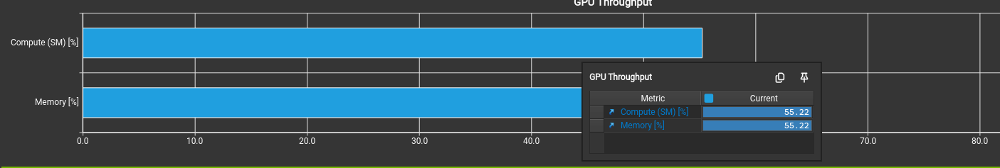
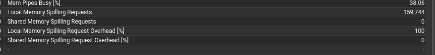

# CUDA Hadamard 变换加速

## 1. 项目概述

Hadamard 旋转可以将激活中的异常值扩散到更多维度，降低单个通道的动态范围，是 QuaRot、SpinQuant 和 FlashAttention-3 等工作改善低比特量化精度的重要手段。然而，旋转本身会引入额外开销；如果 Hadamard 变换耗时过高，FP8/INT4 带来的收益就可能被抵消。

本项目实现并优化了 FP16/BF16 Hadamard 变换 CUDA Kernel，主要工作包括：

- 基于 warp shuffle 的单 warp 实现；
- 使用 128-bit load/store 的向量化实现；
- 面向大维度的 multi-warp 和 chunked multi-warp 实现；
- 根据 `rows` 和 `cols` 选择 Kernel 的 v4 动态分派；
- 参考 HadaCore 探索 Tensor Core 实现；
- 尝试将 MMA 嵌入原有 CUDA Core 数据通路的 Hybrid 实现；
- 将 Hadamard 与 INT8、INT4 和 FP8 per-row/per-group 量化融合；
- 使用 Nsight Compute 分析寄存器压力、occupancy 和 warp stall。

输入张量的原始形状为：

```text
[batch_size, seq_len, num_heads, head_dim]
```

Hadamard 只作用于最后一维，因此实现中将前三维展平：

```text
rows = batch_size × seq_len × num_heads
cols = head_dim
```

本文使用未归一化的 Sylvester Hadamard 变换，与测试中的 `fast_hadamard_transform`（下文简称 FHT）保持一致。正交旋转需要的归一化因子可以与后续计算融合，不影响本文对 Kernel 主体的比较。

在得到满足精度要求的 CUDA Core Hadamard Kernel 后，项目进一步将变换与动态量化融合，以减少中间张量的全局内存读写和 Kernel 启动开销。

## 2. 测试环境与方法

本报告中的性能和精度数据均来自当前系统，不使用此前 A800 上保存的数据。

| 项目 | 配置 |
|---|---|
| 操作系统 | Manjaro Linux，kernel 6.12.101-1-MANJARO |
| GPU | NVIDIA GeForce RTX 4050 Laptop GPU |
| GPU 显存 | 6141 MiB |
| NVIDIA Driver | 610.57.04 |
| CUDA Toolkit | 13.3 |
| 编译目标 | `sm_80` |

正确性测试使用由 FP16/BF16 输入转换得到的 FP32 FWHT 作为参考，并与 FHT 逐元素比较。项目要求的最大绝对误差为：

| 输入类型 | `max|ours-FHT|` 要求 |
|---|---:|
| FP16 | `1e-2` |
| BF16 | `5e-2` |

性能使用 CUDA Event 测量；每个实现先 warmup，再连续执行 100 次并取平均值。对于第 3～6 节的纯 Hadamard 对比，本文定义：

```text
speedup = FHT time / tested kernel time
```

因此 `speedup > 1` 表示测试 Kernel 快于 FHT。不同实现均在同一个 benchmark 进程中使用相同输入规模和计时方法。

第 7 节的融合量化使用“Hadamard v4 + 独立量化”作为基线，并在该节单独定义加速比，避免将两类基线混淆。

代表性实验可通过以下命令复现：

```bash
make -j4 bench
./bench --impl 4      --rows 2048 --dims 64,128,256,512,1024,2048,4096,8192,16384 --dtype all --no-check --iters 100 --warmup-ms 10
./bench --impl hybrid --rows 2048 --dims 256,512,1024,2048,4096,8192              --dtype all --no-check --iters 100 --warmup-ms 10
ROWS=2048 DIMS=256,512,1024,2048,4096,8192,16384 DTYPE=all QUANT=all SCHEME=all fuse/bench.sh
ROWS=2048 COLS=8192 GROUP_SIZE=128 DTYPE=all QUANT=all SCHEME=all fuse/group_bench.sh
```

## 3. CUDA Core Kernel 的优化过程

### 3.1 Scalar：用 warp shuffle 实现 butterfly

长度为 $N$ 的快速 Hadamard 变换包含 $\log_2 N$ 级 butterfly。对于一个 warp 内的 32 个元素，第 `stride` 级需要交换 lane id 相差 `stride` 的数据，天然对应 `__shfl_xor_sync`：

```cpp
#pragma unroll
for (int stride = 1; stride < 32; stride <<= 1) {
    float other = __shfl_xor_sync(0xffffffff, value, stride);
    value = (lane_id & stride) ? other - value : value + other;
}
```

第一版 scalar Kernel 采用“一行一个 warp”的映射。每个 lane 持有若干个间隔为 32 的元素：前五级通过 warp shuffle 完成，剩余级别在单线程的寄存器数组中完成。整个过程不需要共享内存，也没有 block 级同步。

该设计控制逻辑简单、同步开销低；不足是 `cols` 增大后，每线程持有的 FP32 中间值线性增加，寄存器压力随之上升。

### 3.2 Vec：使用 128-bit 向量化访存

FP16/BF16 元素均为 16 bit，因此一次 128-bit 访问可以加载 8 个元素。vec Kernel 将一个 warp 的基本 tile 从 32 个元素扩展为：

```text
32 lanes × 8 elements/lane = 256 elements
```

计算分为三部分：

1. 每线程在寄存器中计算长度为 8 的 Hadamard；
2. 使用 warp shuffle 计算 32 个 lane 之间的 Hadamard；
3. 在每线程持有的多个 256-element tile 之间完成剩余 butterfly。

即：

```text
H8（线程内） → H32（warp shuffle） → tile 间 Hadamard（线程内）
```

该版本仍然只进行一次全局读和一次全局写，但减少了访存指令数量，并将中间结果保留在寄存器中。当前 GPU 上，FP16、`rows=2048` 的结果如下：

| rows | cols | FHT/ms | vec/ms | 加速比 | max abs error |
|---:|---:|---:|---:|---:|---:|
| 2048 | 1024 | 0.028 | 0.016 | 1.73× | 0 |
| 2048 | 2048 | 0.056 | 0.032 | 1.77× | 0 |
| 2048 | 4096 | 0.177 | 0.178 | 0.99× | 0 |
| 2048 | 8192 | 0.394 | 0.383 | 1.03× | 0 |

1024/2048 上的收益并不是减少了算法 FLOP，而是改变了数据交换方式。FHT 使用多个 warp 处理一行，需要通过共享内存完成跨 warp 转置并执行 block barrier；vec 使用一个 warp 处理一行，只依赖寄存器和 warp shuffle，避免了这些开销。

### 3.3 NCU 分析：单 warp 方案的尺寸拐点

随着 `cols` 增大，每线程保存的数据量迅速增加：

| cols | 每线程 FP32 中间值 | 编译得到的寄存器数/线程 |
|---:|---:|---:|
| 1024 | 32 | 45 |
| 2048 | 64 | 78 |
| 4096 | 128 | 149 |
| 8192 | 256 | 255，并出现 spill |

`cols=2048` 的 NCU 报告显示，理论 occupancy 受寄存器限制为 50%，每个 scheduler 理论最多驻留 6 个 warp，而硬件上限为 12。实际调度指标为：

```text
Active Warps Per Scheduler   = 5.53
Eligible Warps Per Scheduler = 0.43
Issued Warps Per Scheduler   = 0.31
```

虽然 active warp 已接近寄存器约束下的理论上限，但平均只有 0.43 个 warp 可以立即执行。NCU 同时报告 Long Scoreboard Stall 占平均指令发射间隔的 64.3%，说明许多 warp 正在等待 L1TEX 路径上的 load dependency。由于可驻留 warp 数不足，调度器难以用其他 warp 隐藏加载延迟，最终 compute 和 memory throughput 都没有达到峰值。



Long Scoreboard 不等价于 DRAM 访问，也不代表一定发生了寄存器溢出；L1 miss 后的 L2 hit 同样经过 L1TEX scoreboard。报告中的 DRAM Slice Workload Imbalance 也必须结合 DRAM 实际吞吐和 L2 hit rate 判断。在 DRAM 负载不高或 Kernel 很短时，slice 的相对不均衡未必是主瓶颈。

到 `cols=8192` 时，寄存器需求达到架构上限，NCU 开始观察到 local-memory 流量：



继续将单 warp vec 直接扩展到 16384/32768 并不可行。实验中强行实例化后，ptxas 分别产生约 2240 和 5120 bytes/thread 的 stack，编译时间也增加到数分钟。因此，大维度必须降低每线程负责的数据量。

### 3.4 Multi-warp per row

大维度版本改为多个 warp 共同处理一行：

- 每个 warp 内仍采用 128-bit load/store、线程内 H8 和 warp shuffle；
- 跨 warp butterfly 通过共享内存交换；
- 每增加一个跨 warp stage，需要同步各 warp 的读写。

该设计增加了共享内存流量和 barrier，但显著降低了每线程寄存器工作集。它本质上是在“单 warp 的低通信开销”和“多 warp 的高 occupancy”之间重新取平衡。

对于 16384/32768，如果把整行 FP32 中间值同时放入共享内存，共享内存容量会限制并发 block 数。chunked multi-warp 将交换区固定为 32 KB，分轮处理相互独立的 chunk，从而控制共享内存占用并避免大规模 spill。

### 3.5 Small：一个 warp 处理多行

当 `cols=2/4/8/16` 时，让一个 warp 只处理一行会浪费大部分 lane。small Kernel 将一个 warp 划分为多个 lane group：

```text
cols=2  → 一个 warp 处理 16 行
cols=4  → 一个 warp 处理 8 行
cols=8  → 一个 warp 处理 4 行
cols=16 → 一个 warp 处理 2 行
```

每组内部仍使用 XOR shuffle，无需共享内存。随着 rows 增大，这种映射能显著摊薄 launch 和调度开销。

## 4. 网格搜索与 v4 动态分派

最优实现不只由 `cols` 决定。当 rows 很少时，单 warp per row 无法提供足够并行度，multi-warp 更有优势；当 rows 足够大时，行之间已经提供充分并行度，vec 则可以避免跨 warp 通信。

分别测试 small、scalar、vec 和 multi-warp 后，最终采用以下策略：

- `cols=2–16`：small；
- `cols=32–128`：scalar；
- `cols=256–8192`：
  - `rows<=64`：multi-warp per row；
  - `rows>=128`：vec；
- `cols=16384–32768`：chunked multi-warp per row。

现有模板固定每线程处理 8 个元素，因此 `cols=256` 无法再拆给多个完整 warp；该点使用 `WARPS_PER_ROW=1`。

当前 GPU 上 `rows=2048` 的代表性结果如下：

| dtype | cols | FHT/ms | v4/ms | 加速比 |
|---|---:|---:|---:|---:|
| FP16 | 64 | 0.004 | 0.003 | 1.53× |
| FP16 | 128 | 0.004 | 0.004 | 1.18× |
| FP16 | 256 | 0.005 | 0.005 | 1.01× |
| FP16 | 512 | 0.009 | 0.009 | 1.01× |
| FP16 | 1024 | 0.028 | 0.016 | 1.73× |
| FP16 | 2048 | 0.056 | 0.032 | 1.77× |
| FP16 | 4096 | 0.177 | 0.178 | 0.99× |
| FP16 | 8192 | 0.394 | 0.383 | 1.03× |
| FP16 | 16384 | 0.785 | 0.781 | 1.01× |
| BF16 | 64 | 0.004 | 0.003 | 1.55× |
| BF16 | 128 | 0.005 | 0.004 | 1.19× |
| BF16 | 256 | 0.005 | 0.005 | 1.02× |
| BF16 | 512 | 0.009 | 0.009 | 1.02× |
| BF16 | 1024 | 0.028 | 0.016 | 1.73× |
| BF16 | 2048 | 0.056 | 0.032 | 1.77× |
| BF16 | 4096 | 0.177 | 0.178 | 1.00× |
| BF16 | 8192 | 0.394 | 0.384 | 1.03× |
| BF16 | 16384 | 0.792 | 0.781 | 1.01× |

结果表明，small 在大量短行上收益明显，vec 在 `cols=1024/2048` 且 rows 充分大时优势突出；大维度下最终实现与高度优化的 FHT 基本持平。动态分派的价值在于避免某一种映射在不适合的区域显著退化。

## 5. Tensor Core 探索

### 5.1 使用 MMA 计算 H16

Hadamard 变换也可以写成矩阵乘法。Ampere Tensor Core 提供：

```text
mma.sync.aligned.m16n8k16
```

该指令计算一个 `16×16` 矩阵与一个 `16×8` 矩阵的乘积，因此一个 `16×16` 输出可以拆成两次 MMA。对于长度为 256 的向量，可以将其 reshape 为 `16×16` 矩阵 $X$，分别沿两个维度应用 $H_{16}$：

$$
Y = H_{16} X H_{16}.
$$

由于 Hadamard 矩阵对称，可以结合转置和 MMA fragment layout，将两个阶段统一为左乘形式。这样 H16 的 A fragment 可以重复使用，并减少两次 MMA 之间的显式寄存器重排。

更大尺寸先完成每个 256-element chunk 内的 $H_{256}$，再对 chunk 维度继续分解。对于不足 16 的维度，通过零填充 MMA 的 K 维；对于超过 16 的维度，将剩余 bit 分批映射为多次 H16 MMA。

为与本项目采用的 FHT 参考路径一致，HadaCore 中 Hadamard 矩阵使用 `±1.0`，原实现写入矩阵常量的 $1/\sqrt{N}$ 归一化已删除；benchmark 中 FHT 的 `scale` 同样设置为 `1.0`。因此下述误差来自浮点计算路径，而不是两种实现采用了不同的归一化定义。

### 5.2 当前 GPU 上的性能

本文将 HadaCore 作为纯 Tensor Core 实现，不再讨论另一份独立的 TC 实验代码。以下结果均为 RTX 4050 Laptop GPU、`rows=2048`：

| dtype | cols | FHT/ms | HadaCore/ms | HadaCore/FHT |
|---|---:|---:|---:|---:|
| FP16 | 64 | 0.004 | 0.002 | 2.16× |
| FP16 | 128 | 0.004 | 0.002 | 1.85× |
| FP16 | 256 | 0.005 | 0.003 | 1.75× |
| FP16 | 512 | 0.009 | 0.007 | 1.25× |
| FP16 | 1024 | 0.028 | 0.013 | 2.23× |
| FP16 | 2048 | 0.057 | 0.047 | 1.22× |
| FP16 | 4096 | 0.178 | 0.127 | 1.39× |
| FP16 | 8192 | 0.394 | 0.394 | 1.00× |
| BF16 | 64 | 0.004 | 0.002 | 2.06× |
| BF16 | 128 | 0.004 | 0.002 | 1.97× |
| BF16 | 256 | 0.005 | 0.003 | 1.68× |
| BF16 | 512 | 0.009 | 0.007 | 1.23× |
| BF16 | 1024 | 0.028 | 0.013 | 2.20× |
| BF16 | 2048 | 0.057 | 0.047 | 1.21× |
| BF16 | 4096 | 0.177 | 0.127 | 1.39× |
| BF16 | 8192 | 0.394 | 0.390 | 1.01× |

HadaCore 最高达到 2.23×，说明 Tensor Core 路线具有很高的吞吐潜力。不过，其收益随尺寸变化明显，且性能收益不能代替正确性判断。

### 5.3 精度对比

使用固定随机种子，在 `rows=32` 上得到以下 `max|kernel-FHT|`。表中的 PASS/FAIL 以及当前 benchmark 均严格使用项目规定的 `1e-2/5e-2`；此前用于探索 Tensor Core 的尺寸相关宽松阈值已删除。

| dtype | cols | HadaCore 误差 | 结果 |
|---|---:|---:|---|
| FP16 | 64 | 1.5625e-2 | FAIL |
| FP16 | 128 | 3.1250e-2 | FAIL |
| FP16 | 256 | 3.1250e-2 | FAIL |
| FP16 | 512 | 6.2500e-2 | FAIL |
| FP16 | 1024 | 6.2500e-2 | FAIL |
| FP16 | 2048 | 1.2500e-1 | FAIL |
| FP16 | 4096 | 2.5000e-1 | FAIL |
| FP16 | 8192 | 2.5000e-1 | FAIL |
| BF16 | 64 | 1.2500e-1 | FAIL |
| BF16 | 128 | 1.2500e-1 | FAIL |
| BF16 | 256 | 2.5000e-1 | FAIL |
| BF16 | 512 | 5.0000e-1 | FAIL |
| BF16 | 1024 | 5.0000e-1 | FAIL |
| BF16 | 2048 | 1.0000e+0 | FAIL |
| BF16 | 4096 | 1.0000e+0 | FAIL |
| BF16 | 8192 | 2.0000e+0 | FAIL |

精度差异主要来自两个方面。

第一，MMA 与标准 FHT 的求和顺序不同。数学上等价的 Hadamard 分解在浮点数中不一定得到相同结果，因为加法不满足结合律。FHT 按 radix-2 butterfly 逐级执行，而 MMA 在 16 项 reduction 中采用硬件定义的累加路径；输入相同，也会产生不同的舍入轨迹。

第二，多个 MMA stage 之间以 16-bit 数据保存中间结果。HadaCore 的 FP16 路径直接采用 FP16 accumulator；BF16 路径采用 FP32 accumulator，但在 MMA 后通过 `cvt.rn.bf16x2.f32` 转回 BF16。下一次 MMA 因而使用已经舍入的 16-bit 中间结果。大尺寸变换包含多个 stage，误差会被反复引入，并在后续加减中继续传播。BF16 尾数更短，因此对这类阶段间转换尤其敏感。

所以，HadaCore 的性能数据可以证明纯 Tensor Core 路线的潜力，但当前精度不满足题目要求，不能作为最终合格实现。

## 6. Hybrid：将 MMA 嵌入原有 Kernel

为了减少纯 Tensor Core 实现的中间舍入，我进一步尝试了 Hybrid 路线：

1. 使用 MMA 完成每个 16-element group 的 $H_{16}$；
2. MMA accumulator 保持为 FP32；
3. 更高 bit 继续使用原有的 warp shuffle、线程内 butterfly 和 shared-memory 跨 warp butterfly；
4. 只在最终写回时转换为 FP16/BF16。

与纯 Tensor Core 版本不同，Hybrid 的 MMA helper 直接返回 FP32 accumulator，中间没有反复执行 FP32→FP16/BF16。因此 Hybrid 仍然出现精度差异时，主要原因是 MMA 对 H16 的 reduction 顺序与标准 radix-2 FHT 不同，而不是多次低精度 round-trip。

### 6.1 性能结果

当前 GPU、`rows=2048` 的结果如下：

| dtype | cols | FHT/ms | Hybrid/ms | Hybrid/FHT |
|---|---:|---:|---:|---:|
| FP16 | 256 | 0.005 | 0.008 | 0.62× |
| FP16 | 512 | 0.009 | 0.018 | 0.49× |
| FP16 | 1024 | 0.028 | 0.040 | 0.70× |
| FP16 | 2048 | 0.056 | 0.108 | 0.52× |
| FP16 | 4096 | 0.179 | 0.256 | 0.70× |
| FP16 | 8192 | 0.393 | 0.696 | 0.57× |
| BF16 | 256 | 0.005 | 0.008 | 0.62× |
| BF16 | 512 | 0.009 | 0.018 | 0.49× |
| BF16 | 1024 | 0.028 | 0.040 | 0.70× |
| BF16 | 2048 | 0.056 | 0.108 | 0.52× |
| BF16 | 4096 | 0.179 | 0.256 | 0.70× |
| BF16 | 8192 | 0.395 | 0.697 | 0.57× |

Hybrid 没有获得预期收益，主要额外开销包括：

- 为满足 MMA fragment layout 而进行的加载和索引映射；
- 将 MMA accumulator scatter 到共享内存，再读回 vec Kernel 所需的 lane-major 布局；
- 每个 256-element chunk 增加的 block barrier；
- 大尺寸下更多 warp 参与一行带来的同步和共享内存流量。

原 vec Kernel 的 H8 与 H32 本身只包含简单的 FP32 add/sub 和 shuffle，已经非常轻量。用 MMA 替换其中一小段计算所节省的算术指令，不足以抵消数据布局转换与同步成本。

### 6.2 精度结果

同样在 `rows=32` 下测得：

| dtype | cols | `max|Hybrid-FHT|` | 结果 |
|---|---:|---:|---|
| FP16 | 256 | 1.5625e-2 | FAIL |
| FP16 | 512 | 6.1035e-5 | PASS |
| FP16 | 1024 | 0 | PASS |
| FP16 | 2048 | 3.9062e-3 | PASS |
| FP16 | 4096 | 3.9062e-3 | PASS |
| FP16 | 8192 | 7.8125e-3 | PASS |
| BF16 | 256–8192 | 0 | PASS |

Hybrid 消除了纯 Tensor Core 版本最明显的多次低精度转换，精度已经显著改善，但 FP16、`cols=256` 仍超过 `1e-2`，因此整体上仍不能宣称通过全部正确性要求。结果也说明 MMA reduction 顺序造成的差异具有输入和 shape 相关性，仅提高 accumulator 精度不能保证逐 shape 通过严格阈值。

综合性能和精度结果，Hybrid 当前既没有超过 FHT，也不能作为最终实现。

## 7. Fused Hadamard Quantization

### 7.1 融合的基本逻辑

非融合路径需要先将 Hadamard 结果写回 FP16/BF16 中间张量，再由独立量化 Kernel 重新读取：

```text
Hadamard
→ 写出 FP16/BF16 中间张量
→ 重新读取中间张量
→ 计算 scale/zero point
→ 写出量化结果
```

融合版本在寄存器中完成 Hadamard 后，直接计算量化参数并写出最终结果：

```text
加载输入
→ 在寄存器中完成 Hadamard
→ 模拟 FP16/BF16 落地舍入
→ 计算 absmax 或 min/max
→ 生成 scale、inv_scale 和 zero point
→ 量化并写出
```

融合没有减少 Hadamard 或量化本身的计算量，主要收益是消除中间张量的一次全局写和一次全局读，同时减少一次 Kernel launch。由于 Hadamard 结果尚在寄存器中，统计和量化可以直接消费这些结果。

融合路径中的 `round_to_storage<T>` 是正确性所必需的。非融合路径会将 FP32 butterfly 结果写成 FP16/BF16，独立量化 Kernel 读取的是已经舍入的值；如果融合版本直接量化寄存器中的 FP32 结果，两条路径可能在 scale、zero point 或临界量化值上产生差异。因此融合 Kernel 在计算统计量前显式执行一次等价的存储类型舍入，使结果与“Hadamard 落地后再量化”逐字节一致。

### 7.2 量化类型

当前实现支持以下组合：

| 输出类型 | 对称量化 | 非对称量化 | 参数 |
|---|---|---|---|
| INT8 | 支持 | 支持 | scale，可选 zero point |
| INT4 | 支持 | 支持 | scale，可选 zero point |
| FP8 E4M3 | scale-only | 不支持 | scale |

对称 INT8/INT4 和 FP8 只需要计算 `absmax`：

$$
\mathrm{scale}=\frac{\mathrm{absmax}}{q_{\max}},\qquad
\mathrm{inv\_scale}=\frac{q_{\max}}{\mathrm{absmax}}.
$$

其中 INT8、INT4 和 FP8 E4M3 的 $q_{\max}$ 分别为 127、7 和 448。实现直接使用 `inv_scale=qmax/absmax`，避免先计算 scale 再取倒数。FP8 每次将两个 FP32 值传给 `__nv_cvt_float2_to_fp8x2`，一个线程持有的 8 个值通过四次向量转换写出。INT4 使用对称范围 `[-7,7]` 或非对称范围 `[0,15]`，并将两个相邻结果打包到一个 byte。

非对称整数路径需要额外计算 group 内的最小值和最大值：

$$
\mathrm{scale}=\frac{x_{\max}-x_{\min}}{q_{\max}-q_{\min}},\qquad
z=\operatorname{clip}\left(\operatorname{round}\left(-\frac{x_{\min}}{\mathrm{scale}}\right)\right).
$$

量化类型和量化方案都是模板参数。只有非对称模板实例会生成 min/max reduction，因而对称量化不会为未使用的最小值统计付出运行时开销。

### 7.3 Per-row 调度与寄存器压力

Per-row 为每一行生成一组量化参数：

```text
scales.shape      = [rows]
zero_points.shape = [rows]  // 仅非对称整数
```

融合 Kernel 不能完全复用纯 Hadamard v4 的 dispatch。纯 Hadamard vec Kernel 主要保存 FP32 butterfly 中间值；融合后还要延长这些值的生命周期，并同时维护 `absmax`、非对称量化的 `min/max`、`scale`、`inv_scale`、`zero_point` 以及类型转换和打包的临时变量。FP8 的向量转换也会引入额外临时值。因此相同 `rows/cols` 下，融合 Kernel 的寄存器压力高于纯 Hadamard Kernel，单 warp vec 路径更早遇到低 occupancy 和延迟隐藏能力不足的问题。

Multi-warp per row 将一行分配给多个 warp，可以降低每个线程持有的 Hadamard 工作集，代价是增加 shared-memory 交换和 block barrier。通过在当前 GPU 上强制运行 vec 和 multi-warp 两个版本进行 A/B 测试，最终得到以下 per-row 自动调度：

| 量化类型 | cols | 自动选择 |
|---|---:|---|
| INT8/INT4 | 256、512 | vec |
| INT8/INT4 | 1024～4096 | `rows<=64` 使用 multi-warp，否则使用 vec |
| INT8/INT4 | 8192 | multi-warp |
| FP8 | 256 | vec |
| FP8 | 512 | `rows<=256` 使用 multi-warp，否则使用 vec |
| FP8 | 1024 | `rows<=512` 使用 multi-warp，否则使用 vec |
| FP8 | 2048 | `rows<=1024` 使用 multi-warp，否则使用 vec |
| FP8 | 4096、8192 | multi-warp |
| 全部类型 | 16384、32768 | chunked multi-warp |

例如在 `cols=8192, rows=2048` 下，multi-warp 相对 vec 在 FP16 INT8、INT4 和 FP8 上分别约快 1.08×、1.24× 和 1.40×。因此融合版本固定让 `cols=8192` 使用 multi-warp，即使纯 Hadamard v4 在大 rows 时仍可能选择 vec。

### 7.4 Per-group 融合

Per-group 沿每一行的连续列方向分组：

```text
groups_per_row    = cols / group_size
scales.shape      = [rows, groups_per_row]
zero_points.shape = [rows, groups_per_row]
```

Hadamard 仍然作用于完整的一行；只有 Hadamard 完成后的统计和量化按 group 划分。当前 vec 数据布局中，每个 lane 持有连续 8 个结果，每个 warp 覆盖连续 256 个元素，因此可以根据 group 大小选择不同 reduction：

- `group_size<8`：group 完全位于单个线程持有的 8 个结果中，使用线程局部统计；
- `8<=group_size<=256`：将 warp 划分为多个 lane group，通过限定宽度的 shuffle 分别计算统计量；
- `group_size>256`：每个 warp 先生成连续 256 元素的 partial statistics，再复用 Hadamard 已经释放的 shared-memory 交换区进行合并。

`cols>=256` 时，per-group 实现主要使用 multi-warp per row。除了降低寄存器压力，它还使每个 warp 负责的连续 256 元素 segment 与 group reduction 自然对齐。`cols=16384/32768` 继续使用固定 32 KB 交换区的 chunked 方案。

### 7.5 为什么没有实现动态 per-tensor

动态 per-tensor 量化需要整个 `[rows,cols]` 的全局 `absmax` 或 `min/max`。普通 CUDA Kernel 只提供 block 内同步，不能安全地完成如下过程：

```text
所有 block 完成 Hadamard
→ 汇总全 tensor 的量化参数
→ 所有 block 使用最终参数量化
```

使用 atomic 更新全局最大值并不能解决同步问题：较早开始量化的 block 可能读取尚未收敛的 scale。可行方案通常需要写出 Hadamard 中间张量后分阶段执行全局 reduction 和量化，或者重复计算一次 Hadamard；cooperative launch 则受到同时驻留 block 数的限制。也可以由外部校准过程预先提供 per-tensor scale，但这不再是本文实现的动态量化语义。

这些方案都会重新引入中间访存、额外计算或更严格的启动约束，削弱本项目融合 Kernel 的主要收益。因此当前实现选择动态 per-row 和 per-group，没有实现动态 per-tensor。

### 7.6 性能测试方法

融合量化使用 CUDA Event 计时，warmup 20 ms，随后执行 100 次并取平均。这里的基线不是 FHT，而是功能完全相同的非融合组合：

```text
separate = Hadamard v4 + standalone quantization
speedup  = separate time / fused time
```

Per-group 的 standalone quantization 同样采用向量化实现：一个 warp 读取连续 256 个 Hadamard 结果，通过子 warp reduction 计算各 group 的统计量。因此下述加速比没有使用“一组一个 block”的朴素参考实现；后者会产生大量小 block，并明显夸大融合收益。这里的数据衡量融合版本相对本项目非融合实现的收益，不代表相对所有可能量化实现的理论上限。

### 7.7 Per-row 性能结果

下表为当前 RTX 4050 Laptop GPU、`rows=2048` 的结果。每个单元格为“融合时间 / 相对非融合路径加速比”。

| FP16 cols | INT8 对称 | INT8 非对称 | INT4 对称 | INT4 非对称 | FP8 |
|---:|---:|---:|---:|---:|---:|
| 256 | 0.006 ms / 4.87× | 0.007 ms / 4.55× | 0.006 ms / 4.82× | 0.006 ms / 4.51× | 0.012 ms / 2.81× |
| 512 | 0.009 ms / 3.79× | 0.010 ms / 3.64× | 0.009 ms / 3.68× | 0.010 ms / 3.56× | 0.022 ms / 2.18× |
| 1024 | 0.017 ms / 3.01× | 0.017 ms / 3.00× | 0.017 ms / 2.83× | 0.018 ms / 2.83× | 0.042 ms / 1.79× |
| 2048 | 0.032 ms / 2.67× | 0.032 ms / 2.64× | 0.032 ms / 2.45× | 0.033 ms / 2.41× | 0.087 ms / 1.53× |
| 4096 | 0.077 ms / 4.08× | 0.079 ms / 3.96× | 0.064 ms / 4.04× | 0.066 ms / 3.94× | 0.187 ms / 1.99× |
| 8192 | 0.281 ms / 2.47× | 0.300 ms / 2.32× | 0.260 ms / 2.48× | 0.275 ms / 2.35× | 0.489 ms / 1.59× |
| 16384 | 0.566 ms / 2.49× | 0.586 ms / 2.40× | 0.552 ms / 2.35× | 0.558 ms / 2.33× | 0.801 ms / 1.98× |

| BF16 cols | INT8 对称 | INT8 非对称 | INT4 对称 | INT4 非对称 | FP8 |
|---:|---:|---:|---:|---:|---:|
| 256 | 0.006 ms / 4.86× | 0.007 ms / 4.58× | 0.006 ms / 4.84× | 0.006 ms / 4.50× | 0.012 ms / 2.79× |
| 512 | 0.009 ms / 3.81× | 0.010 ms / 3.66× | 0.009 ms / 3.71× | 0.010 ms / 3.58× | 0.022 ms / 2.17× |
| 1024 | 0.017 ms / 3.00× | 0.018 ms / 2.99× | 0.017 ms / 2.90× | 0.018 ms / 2.83× | 0.043 ms / 1.78× |
| 2048 | 0.032 ms / 2.69× | 0.033 ms / 2.60× | 0.032 ms / 2.47× | 0.033 ms / 2.39× | 0.088 ms / 1.53× |
| 4096 | 0.078 ms / 4.01× | 0.080 ms / 3.90× | 0.064 ms / 4.03× | 0.069 ms / 3.79× | 0.189 ms / 1.98× |
| 8192 | 0.287 ms / 2.42× | 0.289 ms / 2.41× | 0.260 ms / 2.48× | 0.277 ms / 2.34× | 0.486 ms / 1.61× |
| 16384 | 0.558 ms / 2.52× | 0.587 ms / 2.40× | 0.547 ms / 2.38× | 0.568 ms / 2.29× | 0.908 ms / 1.75× |

INT8/INT4 的大部分尺寸获得约 2.3～4.9× 加速，FP8 获得约 1.5～2.8×。FP8 收益相对较低，原因是 E4M3 转换本身比整数 round、clamp 和 pack 更重；即使消除了中间访存，转换指令仍占据较大比例。`cols=4096` 上整数路径的加速比再次升高，还与非融合 Hadamard v4 在该尺寸本身较慢有关，因此加速比应与融合绝对时间一起解读。

### 7.8 Per-group 性能结果

下表固定 `rows=2048, group_size=128`，同样给出“融合时间 / 相对向量化非融合路径加速比”。

| FP16 cols | INT8 对称 | INT8 非对称 | INT4 对称 | INT4 非对称 | FP8 |
|---:|---:|---:|---:|---:|---:|
| 1024 | 0.036 ms / 0.98× | 0.037 ms / 0.95× | 0.034 ms / 0.99× | 0.037 ms / 0.96× | 0.050 ms / 1.17× |
| 2048 | 0.065 ms / 0.98× | 0.071 ms / 0.96× | 0.065 ms / 0.99× | 0.071 ms / 0.97× | 0.093 ms / 1.22× |
| 4096 | 0.133 ms / 1.85× | 0.144 ms / 1.75× | 0.131 ms / 1.70× | 0.141 ms / 1.63× | 0.195 ms / 1.66× |
| 8192 | 0.308 ms / 2.21× | 0.314 ms / 2.17× | 0.298 ms / 2.01× | 0.303 ms / 1.98× | 0.505 ms / 1.33× |

BF16 的趋势与 FP16 一致：`cols=1024/2048` 的整数融合路径约为 0.96～1.00×，`cols=4096` 为 1.63～1.86×，`cols=8192` 为 1.94～2.20×；FP8 分别为 1.17×、1.22×、1.68× 和 1.35×。小尺寸下，中间张量的访存量较小，standalone vec 量化又已经具有充分并行度；此时 per-group 融合版本固定采用 multi-warp 所增加的跨 warp 同步抵消了访存收益。尺寸增大后，中间张量的全局访存成本上升，融合优势才变得明显。这也说明 per-group 后续仍有必要像 per-row 一样对小尺寸增加 vec 路径和动态 dispatch。

### 7.9 精度与一致性

项目要求融合量化结果与“先变换后量化”一致。测试直接比较量化后的每个 byte、每个 scale，以及非对称量化的每个 zero point，而不是只比较反量化后的近似浮点值。

本次 per-row 性能测试覆盖 2 种输入类型、7 个尺寸和 5 种量化配置，共 70 个组合；per-group 还使用小 group、warp 内 group、跨 256 元素 group 以及 8/16-warp chunked 路径进行了扩展回归，`cols` 最大为 32768。结果统一为：

| 检查项 | 最大误差或不一致数量 |
|---|---:|
| quantized output mismatch | 0 |
| scale max absolute error | 0 |
| zero-point mismatch | 0 |

因此 FP16/BF16、INT8/INT4 对称与非对称、FP8 scale-only，以及 per-row/per-group 路径均满足项目对融合量化一致性的要求。

## 8. 总结与后续方向

本项目最终可用的方案是 CUDA Core v4 动态分派：

- 小维度通过一个 warp 处理多行提高 lane 利用率；
- 中等维度通过 scalar 或 128-bit vec 避免共享内存与 block barrier；
- 小 rows 时增加每行 warp 数，以提供足够并行度；
- 大维度通过 multi-warp 和固定共享内存的 chunked 版本避免寄存器溢出。

在此基础上，项目进一步实现了动态 per-row 和 per-group Fused Hadamard Quantization，支持 FP16/BF16 输入、INT8/INT4 对称与非对称量化以及 FP8 E4M3 scale-only 量化。融合路径通过消除 Hadamard 中间张量的写回和重读获得加速，同时使用显式存储类型舍入保证与非融合路径逐字节一致。

在当前 RTX 4050 Laptop GPU 上，v4 在 `rows=2048, cols=1024/2048` 时分别达到 1.73× 和 1.77×；在更大维度上与 FHT 基本持平。

融合量化方面，per-row INT8/INT4 在代表性尺寸上相对非融合路径获得约 2.3～4.9× 加速，FP8 获得约 1.5～2.8×；`group_size=128` 的 per-group 路径在 `cols=4096/8192` 上获得约 1.3～2.2×。全部融合测试的量化输出、scale 和 zero point 均与先变换后量化的结果完全一致。

作为纯 Tensor Core 实现，HadaCore 展示了最高约 2.23× 的性能潜力，但没有通过项目规定的严格精度检查。该路径同时受到计算顺序变化和阶段间 16-bit 舍入影响；Hybrid 将 MMA 输出保留为 FP32，显著改善了精度，但 MMA reduction 顺序以及额外的数据布局转换仍分别限制精度和性能。

后续可以继续探索：

- 设计与 radix-2 butterfly 更接近的 MMA 分解和累加树；
- 减少或消除多个 MMA stage 之间的低精度转换；
- 只在计算密度足够高、布局转换可被摊薄的阶段使用 Tensor Core；
- 使用 NCU Source/SASS 进一步定位 global load-use dependency，并尝试软件流水化；
- 为 per-group 的中小尺寸补充 vec 路径和基于 `rows/cols/group_size` 的动态 dispatch；
- 如果应用能够提供校准得到的固定 scale，进一步实现无需全局 reduction 的静态 per-tensor 融合路径。
